# 🍽️ Restaurant Management System — PRO192

> Hệ thống quản lý nhà hàng được xây dựng bằng Java (Console), phân chia theo 4 module chức năng độc lập.

---

## 👥 Phân công thành viên

| Member | Module | Mô tả |
|--------|--------|-------|
| Member 1 | User & Access Management | Quản lý người dùng, phân quyền nhân viên |
| Member 2 | Inventory & Product Management | Quản lý danh mục, thực đơn, tồn kho |
| Member 3 | Sales & Order Management | Quản lý bàn, đơn hàng, gọi món |
| Member 4 | Payment & Reporting | Thanh toán, hóa đơn, báo cáo doanh thu |

---

## 📐 UML Class Diagram (Toàn hệ thống)

```mermaid
classDiagram

%% =====================
%% MEMBER 1 — User & Access Management
%% =====================

class User {
    <<abstract>>
    - userId : int
    - username : String
    - password : String
    - fullName : String
    - email : String
    - isActive : boolean
    + getUserId() : int
    + getUsername() : String
    + getFullName() : String
    + setPassword(pwd: String) : void
    + isActive() : boolean
    + setActive(active: boolean) : void
    + login(username: String, password: String) : boolean
    + logout() : void
    + toString() : String
}

class Manager {
    - managerId : int
    - department : String
    + getManagerId() : int
    + getDepartment() : String
    + addEmployee(e: Employee) : void
    + removeEmployee(e: Employee) : void
    + viewAllEmployees() : List~Employee~
    + generateReport() : void
}

class Employee {
    - employeeId : int
    - position : String
    - salary : double
    - hireDate : Date
    + getEmployeeId() : int
    + getPosition() : String
    + getSalary() : double
    + setSalary(salary: double) : void
    + getHireDate() : Date
    + viewAssignedTables() : List~Table~
}

class Cashier {
    - cashierId : int
    - shiftStart : Date
    - shiftEnd : Date
    + getCashierId() : int
    + getShiftStart() : Date
    + getShiftEnd() : Date
    + processCheckout(order: Order) : Invoice
    + viewDailyRevenue() : double
}

User <|-- Manager   : extends
User <|-- Employee  : extends
User <|-- Cashier   : extends

%% =====================
%% MEMBER 2 — Inventory & Product Management
%% =====================

class Category {
    - categoryId : int
    - name : String
    - description : String
    - isActive : boolean
    + getId() : int
    + getName() : String
    + setName(name: String) : void
    + isActive() : boolean
    + toString() : String
}

class MenuItem {
    - itemId : int
    - name : String
    - description : String
    - price : double
    - category : Category
    - isAvailable : boolean
    + getItemId() : int
    + getName() : String
    + getPrice() : double
    + setPrice(p: double) : void
    + getCategory() : Category
    + setAvailable(b: boolean) : void
    + toString() : String
}

class InventoryItem {
    - inventoryId : int
    - menuItem : MenuItem
    - quantity : int
    - minQuantity : int
    - unit : String
    - lastUpdated : Date
    + getQuantity() : int
    + setQuantity(q: int) : void
    + addStock(q: int) : void
    + reduceStock(q: int) : void
    + isLowStock() : boolean
    + isOutOfStock() : boolean
    + getMenuItem() : MenuItem
    + toString() : String
}

%% =====================
%% MEMBER 3 — Sales & Order Management
%% =====================

class Table {
    - tableId : int
    - tableName : String
    - isOccupied : boolean
    + getTableId() : int
    + getTableName() : String
    + isOccupied() : boolean
    + checkAvailability() : boolean
    + setOccupied(occupied: boolean) : void
    + toString() : String
}

class Order {
    - orderId : String
    - table : Table
    - details : List~OrderDetail~
    - totalPrice : double
    - isPaid : boolean
    + getOrderId() : String
    + getTable() : Table
    + getDetails() : List~OrderDetail~
    + getTotalPrice() : double
    + setPaid(paid: boolean) : void
    + addDetail(item: MenuItem, qty: int) : void
    + removeDetail(item: MenuItem) : void
    + calculateTotal() : double
    + toString() : String
}

class OrderDetail {
    - menuItem : MenuItem
    - quantity : int
    - orderPrice : double
    + getMenuItem() : MenuItem
    + getQuantity() : int
    + setQuantity(q: int) : void
    + getOrderPrice() : double
    + getSubTotal() : double
    + toString() : String
}

%% =====================
%% MEMBER 4 — Payment & Reporting
%% =====================

class Payment {
    - paymentId : String
    - invoiceId : String
    - amount : double
    - paymentDate : Date
    - method : String
    + processPayment() : boolean
    + recordTransaction() : void
    + getPaymentStatus() : String
    + cancelPayment() : void
}

class Invoice {
    - invoiceId : String
    - order : Order
    - payment : Payment
    - totalAmount : double
    - issueDate : Date
    - status : String
    + createInvoice() : void
    + printInvoice() : void
    + updateStatus(status: String) : void
    + getInvoiceById(id: String) : Invoice
}

class Report {
    - reportId : String
    - totalAmount : double
    - issueDate : Date
    - status : String
    + generateDailyReport() : Report
    + generateMonthlyReport() : Report
    + generateYearlyReport() : Report
    + exportReport() : void
}

%% =====================
%% RELATIONSHIPS
%% =====================

Category    "1"  o--  "0..*"  MenuItem      : contains
MenuItem    "1"  -->  "1"     InventoryItem : tracked by
Table       "1"  -->  "0..*"  Order         : has
Order       "1"  *--  "1..*"  OrderDetail   : contains
OrderDetail "1"  -->  "1"     MenuItem      : references
Order       "1"  -->  "1"     Invoice       : generates
Invoice     "1"  -->  "1"     Payment       : paid via
Invoice     "1"  ..>  "1"     Report        : included in
Manager     "1"  -->  "0..*"  Employee      : manages
Cashier     "1"  -->  "0..*"  Order         : processes
Employee    "1"  -->  "0..*"  Table         : serves
```



---

## 🗂️ Cấu trúc dự án

```
RestaurantManagement/
│
├── src/
│   └── main/
│       └── java/
│           └── com/
│               └── restaurant/
│                   │
│                   ├── model/                          # Toàn bộ các lớp thực thể (POJO)
│                   │   ├── User.java                   # [Member 1] Lớp cha trừu tượng người dùng
│                   │   ├── Manager.java                # [Member 1] Quản lý
│                   │   ├── Employee.java               # [Member 1] Nhân viên phục vụ
│                   │   ├── Cashier.java                # [Member 1] Thu ngân
│                   │   ├── Category.java               # [Member 2] Danh mục món ăn
│                   │   ├── MenuItem.java               # [Member 2] Món ăn trong thực đơn
│                   │   ├── InventoryItem.java          # [Member 2] Tồn kho nguyên liệu
│                   │   ├── Table.java                  # [Member 3] Bàn ăn
│                   │   ├── Order.java                  # [Member 3] Đơn hàng
│                   │   ├── OrderDetail.java            # [Member 3] Chi tiết đơn hàng
│                   │   ├── Payment.java                # [Member 4] Thanh toán
│                   │   ├── Invoice.java                # [Member 4] Hóa đơn
│                   │   └── Report.java                 # [Member 4] Báo cáo doanh thu
│                   │
│                   ├── service/                        # Lớp xử lý logic nghiệp vụ
│                   │   ├── UserService.java            # [Member 1] Đăng nhập / xác thực
│                   │   ├── ManagerService.java         # [Member 1] Quản lý nhân viên
│                   │   ├── EmployeeService.java        # [Member 1] CRUD nhân viên
│                   │   ├── CategoryService.java        # [Member 2] CRUD danh mục
│                   │   ├── MenuService.java            # [Member 2] CRUD thực đơn
│                   │   ├── InventoryService.java       # [Member 2] Quản lý tồn kho
│                   │   ├── TableService.java           # [Member 3] Quản lý bàn
│                   │   ├── OrderService.java           # [Member 3] Tạo/hủy đơn hàng
│                   │   ├── OrderDetailService.java     # [Member 3] Gọi món / hủy món
│                   │   ├── PaymentService.java         # [Member 4] Xử lý thanh toán
│                   │   ├── InvoiceService.java         # [Member 4] Tạo & in hóa đơn
│                   │   └── ReportService.java          # [Member 4] Thống kê doanh thu
│                   │
│                   ├── repository/                     # Lưu trữ dữ liệu trong bộ nhớ (List/Map)
│                   │   ├── UserRepository.java
│                   │   ├── CategoryRepository.java
│                   │   ├── MenuItemRepository.java
│                   │   ├── InventoryRepository.java
│                   │   ├── TableRepository.java
│                   │   ├── OrderRepository.java
│                   │   ├── PaymentRepository.java
│                   │   └── InvoiceRepository.java
│                   │
│                   ├── ui/                             # Giao diện console (Menu, Scanner)
│                   │   ├── MainMenu.java               # Menu chính điều hướng module
│                   │   ├── UserUI.java                 # [Member 1] Giao diện đăng nhập/quản lý user
│                   │   ├── InventoryUI.java            # [Member 2] Giao diện quản lý kho
│                   │   ├── OrderUI.java                # [Member 3] Giao diện đặt bàn/gọi món
│                   │   └── PaymentUI.java              # [Member 4] Giao diện thanh toán/báo cáo
│                   │
│                   └── Main.java                       # Entry point — khởi chạy ứng dụng
│
├── data/                                               # File dữ liệu giả lập (nếu dùng file I/O)
│   ├── users.txt
│   ├── categories.txt
│   ├── menu_items.txt
│   ├── tables.txt
│   ├── orders.txt
│   └── payments.txt
│
├── docs/
│   ├── uml-class-diagram.md                            # File này
│   └── usecase-diagram.md                              # Sơ đồ usecase (nếu có)
│
└── README.md
```

---

## 🔗 Luồng dữ liệu giữa các module

```
[Member 1 — Users]       [Member 2 — Inventory]     [Member 3 — Orders]      [Member 4 — Payment]
──────────────────        ─────────────────────       ───────────────────       ────────────────────
User (abstract)           Category                    Table
  ├── Manager                 │                           │
  ├── Employee                ▼                           ▼
  └── Cashier ──────► MenuItem ──────────────► OrderDetail ──► Order ───────────► Invoice
        │                 │                                                            │
        │                 ▼                                                            ▼
        │           InventoryItem                                                 Payment
        │           (giảm tồn kho                                                     │
        │            khi gọi món)                                                     ▼
        └────────────────────────────────────────────────────────────────────────► Report
```

---

## 📋 Mô tả chi tiết từng module

### Module 1 — User & Access Management

Quản lý người dùng hệ thống theo mô hình kế thừa: `User` (lớp cha abstract) → `Manager`, `Employee`, `Cashier`.

**Chức năng chính:**
- Đăng nhập / Đăng xuất (`login()`, `logout()`)
- Phân quyền theo vai trò: Manager / Employee / Cashier
- CRUD tài khoản nhân viên (Manager thực hiện)
- Khoá / mở tài khoản (`setActive()`)

**Phân quyền theo role:**

| Role | Quyền hạn |
|------|-----------|
| `Manager` | Toàn quyền: quản lý nhân viên, xem báo cáo, cài đặt hệ thống |
| `Employee` | Xem bàn, gọi món, tạo đơn hàng |
| `Cashier` | Thanh toán, in hóa đơn, xem doanh thu ca |

**Điểm kết nối với module khác:**
- `Cashier.processCheckout(order)` → gọi sang **Module 4** tạo `Invoice`
- `Employee.viewAssignedTables()` → liên kết với **Module 3** lấy danh sách `Table`

---

### Module 2 — Inventory & Product Management

Quản lý danh mục món ăn (`Category`), thực đơn (`MenuItem`) và tồn kho (`InventoryItem`).

**Chức năng chính:**
- CRUD danh mục và thực đơn
- Theo dõi số lượng tồn kho theo từng món
- Cảnh báo khi tồn kho xuống dưới ngưỡng tối thiểu (`isLowStock()`)
- Khóa món không còn phục vụ (`setAvailable(false)`)

---

### Module 3 — Sales & Order Management

Quản lý bàn ăn (`Table`), đơn hàng (`Order`) và chi tiết gọi món (`OrderDetail`).

**Chức năng chính:**
- Xem sơ đồ bàn (Trống / Có khách)
- Tạo đơn hàng gắn với bàn đang chọn
- Thêm / Giảm / Hủy món trong đơn
- Tự động tính tổng tiền sau mỗi thao tác (`calculateTotal()`)
- Khoá đơn sau khi thanh toán (`setPaid(true)`)

**Ghi chú logic `isPaid`:**
- `false` → Đơn đang mở, nhân viên có thể chỉnh sửa
- `true` → Đơn đã thanh toán, bị khoá, bàn trả về trạng thái trống

---

### Module 4 — Payment & Reporting

Quản lý thanh toán (`Payment`), hóa đơn (`Invoice`) và báo cáo doanh thu (`Report`).

**Chức năng chính:**

**A. Thanh toán & Ghi nhận giao dịch**
1. Truy xuất Mã đơn hàng & Tổng tiền từ `Order`
2. Chọn phương thức: Tiền mặt / Thẻ / Chuyển khoản
3. Xác thực giao dịch qua nhân viên hoặc cổng thanh toán
4. Tạo bản ghi `Payment`, cập nhật `Order.isPaid = true`

**B. In hóa đơn**
1. Tổng hợp dữ liệu từ `Order` (danh sách món) và `Payment` (mã giao dịch)
2. Đóng gói thành PDF hoặc giao diện xem trước
3. Gửi lệnh in ra máy in biên lai

**C. Thống kê & Báo cáo**
1. Chọn bộ lọc thời gian (Ngày / Tháng / Năm)
2. Truy vấn tất cả `Invoice` hợp lệ trong khoảng thời gian
3. Tính tổng doanh thu, số giao dịch, giá trị đơn trung bình (AOV)
4. Xuất báo cáo (Excel / PDF)

---

## ⚙️ Yêu cầu kỹ thuật

| Mục | Chi tiết |
|-----|---------|
| Ngôn ngữ | Java 17+ |
| Giao diện | Console (Scanner) |
| Lưu trữ | In-memory (`ArrayList`, `HashMap`) hoặc File I/O |
| Build tool | Không bắt buộc (có thể dùng Maven) |
| IDE khuyến nghị | IntelliJ IDEA / Eclipse |

---


## 📌 Ghi chú phát triển

- Mỗi thành viên phát triển độc lập module của mình theo đúng UML đã thống nhất.
- Điểm kết nối giữa các module: `User/Cashier` (M1↔M4), `MenuItem` (M2↔M3), `Order` (M3↔M4), `Table` (M1↔M3).
- Không được thay đổi `public interface` (tên phương thức, kiểu trả về) của class dùng chung khi chưa thống nhất với nhóm.
- Dữ liệu mẫu để test nên được khởi tạo trong `Main.java` hoặc một class `DataSeeder` riêng.
