# 🍽️ Restaurant Management System — PRO192

> Hệ thống quản lý nhà hàng được xây dựng bằng Java (Console), lưu trữ dữ liệu bằng file TXT, áp dụng **Generic Repository Pattern**, **Layered Architecture (Repository → Service → Router → UI)** và phân chia theo 4 module chức năng.

---

## 👥 Phân công thành viên

| Member | Module | Mô tả |
|--------|--------|-------|
| Member 1 | User & Access Management | Quản lý người dùng, phân quyền, đăng nhập (Role, AuthService) |
| Member 2 | Inventory & Product Management | Quản lý danh mục, thực đơn, tồn kho |
| Member 3 | Sales & Order Management | Quản lý bàn, đơn hàng, gọi món |
| Member 4 | Payment & Reporting | Thanh toán, hóa đơn, báo cáo doanh thu |

---

## 🏗️ Kiến trúc tổng quan

Hệ thống có nhiều thực thể (`Table`, `Order`, `Invoice`, `InventoryItem`, `MenuItem`, `User`...) đều cần các thao tác CRUD và đọc/ghi file TXT giống nhau. Nếu mỗi Repository tự viết lại toàn bộ logic này sẽ gây trùng lặp code, khó bảo trì, vi phạm DRY và khó mở rộng sang Database sau này.

**Giải pháp:** áp dụng Generic Programming + Repository Pattern + Template Method Pattern + Dependency Inversion Principle (SOLID).

```plaintext
UI (UIManager / InventoryUI / OrderUI / PaymentUI)
↓ (chọn theo Role)
Router  ──────────────► dispatch theo user.getRole()
↓
Service (IService / BaseService + Service con)
↓
IRepository<T, ID>
↑
BaseRepository<T, ID>  (CRUD + đọc/ghi file dùng chung)
↑
├── UserRepository
├── TableRepository
├── OrderRepository
├── InvoiceRepository
├── InventoryRepository
├── MenuItemRepository
├── CategoryRepository
└── PaymentRepository
↓
TXT FILE (data/*.txt)
```

**Luồng xác thực:**

```plaintext
Main.java
  → AuthService.login(username, password)
  → trả về User (đã có Role)
  → Router.route(user)
  → dispatch UI tương ứng theo Role
```

---

## 🔑 IRepository — Hợp đồng chung cho mọi Repository

Định nghĩa hành vi CRUD mà mọi Repository phải hỗ trợ, không quan tâm thực thể là gì hay lưu ở đâu (TXT, sau này có thể là Database).

```java
public interface IRepository<T, ID> {

    List<T> findAll();

    T findById(ID id);

    void save(T entity);

    void delete(ID id);

}
```

| Phương thức | Vai trò | Ví dụ |
|---|---|---|
| `findAll()` | Lấy toàn bộ dữ liệu | `tableRepository.findAll()` |
| `findById(id)` | Tìm phần tử theo khóa | `orderRepository.findById("OD01")` |
| `save(entity)` | Thêm mới hoặc cập nhật | `tableRepository.save(table)` |
| `delete(id)` | Xóa dữ liệu | `tableRepository.delete(3)` |

---

## 🧱 BaseRepository — Triển khai phần dùng chung

`BaseRepository<T, ID>` implements `IRepository<T, ID>`, chịu trách nhiệm: CRUD trên danh sách trong bộ nhớ, đọc file, ghi file. Repository con chỉ cần lo việc chuyển đổi dữ liệu (parse/format) cho đúng thực thể của nó.

**Thuộc tính:**

```java
protected List<T> data;
protected String filePath;
```

**Constructor — tự động nạp dữ liệu khi khởi tạo:**

```java
public BaseRepository(String filePath) {
    this.filePath = filePath;
    this.data = new ArrayList<>();
    loadFromFile();
}
```

→ Khi gọi `new TableRepository()`, dữ liệu từ file TXT được nạp ngay vào `data`.

**Đọc/ghi file dùng chung:**

```java
protected void saveToFile()   // mở file → duyệt data → ghi từng dòng → đóng file
protected void loadFromFile() // mở file → đọc từng dòng → parse object → thêm vào data
```

**Giải quyết khác biệt giữa các thực thể (Table, Order...) bằng Template Method — 2 hàm trừu tượng mà Repository con buộc phải hiện thực:**

```java
protected abstract T parseLine(String line);
protected abstract String toLine(T entity);
```

### Ví dụ — TableRepository

```java
public class TableRepository extends BaseRepository<Table, Integer> {

    @Override
    protected Table parseLine(String line) {
        String[] d = line.split(",");
        return new Table(
            Integer.parseInt(d[0]),
            d[1],
            Integer.parseInt(d[2]),
            Boolean.parseBoolean(d[3])
        );
    }

    @Override
    protected String toLine(Table table) {
        return table.getTableId() + "," + table.getTableName()
            + "," + table.getCapacity() + "," + table.isOccupied();
    }
}
```

File `tables.txt`:
```plaintext
1,Ban A,4,false
2,Ban B,6,true
```

### Ví dụ — OrderRepository

```java
public class OrderRepository extends BaseRepository<Order, String> {

    @Override
    protected Order parseLine(String line) {
        String[] d = line.split(",");
        Order order = new Order(d[0], null);
        order.setPaid(Boolean.parseBoolean(d[1]));
        return order;
    }

    @Override
    protected String toLine(Order order) {
        return order.getOrderId() + "," + order.isPaid();
    }
}
```

File `orders.txt`:
```plaintext
OD01,false
OD02,true
```

---

## 🧩 IService / BaseService — Lớp xử lý nghiệp vụ

Giữa `Router`/`UI` và `Repository` có thêm lớp **Service** để tách logic nghiệp vụ (validate, tính toán, điều phối nhiều Repository) ra khỏi tầng lưu trữ dữ liệu. UI/Router không bao giờ gọi trực tiếp Repository.

```java
public interface IService<T, ID> {

    List<T> getAll();

    T getById(ID id);

    void add(T entity);

    void update(T entity);

    void remove(ID id);

}
```

```java
public abstract class BaseService<T, ID> implements IService<T, ID> {

    protected IRepository<T, ID> repository;

    public BaseService(IRepository<T, ID> repository) {
        this.repository = repository;
    }

    @Override
    public List<T> getAll() {
        return repository.findAll();
    }

    @Override
    public T getById(ID id) {
        return repository.findById(id);
    }

    @Override
    public void add(T entity) {
        repository.save(entity);
    }

    @Override
    public void update(T entity) {
        repository.save(entity);
    }

    @Override
    public void remove(ID id) {
        repository.delete(id);
    }
}
```

Mỗi Service con (`TableService`, `OrderService`, `MenuService`...) extends `BaseService<T, ID>` và chỉ cần viết thêm các nghiệp vụ riêng (ví dụ: `OrderService.calculateTotal()`, `InventoryService.isLowStock()`), CRUD cơ bản đã có sẵn từ lớp cha.

---

## 🛡️ Role & AuthService — Xác thực và phân quyền

### Role (enum)

Thay cho việc `User` phải có 3 class con kế thừa (`Manager`, `Employee`, `Cashier`), hệ thống dùng **1 class `User` duy nhất** với field `Role role`, giúp đơn giản hóa việc parse/lưu User vào TXT (không cần xử lý đa hình khi đọc file) và để `Router` dễ dispatch theo `switch`.

```java
public enum Role {
    MANAGER,
    WAREHOUSE,
    EMPLOYEE,
    CASHIER
}
```

> ⚠️ Lưu ý: ngoài 3 vai trò gốc theo UML ban đầu (Manager / Employee / Cashier), thực tế triển khai có thêm `WAREHOUSE` (phụ trách Module 2 — Inventory & Product Management) để khớp với `InventoryUI`.

### AuthService

Chịu trách nhiệm toàn bộ logic xác thực: kiểm tra username/password, giới hạn số lần đăng nhập sai, kiểm tra `isActive`, trả về `User` (kèm `Role`) cho `Main.java` để truyền vào `Router`.

```java
public class AuthService {

    private UserRepository userRepository;
    private static final int MAX_LOGIN_ATTEMPTS = 3;

    public AuthService(UserRepository userRepository) {
        this.userRepository = userRepository;
    }

    public User login(String username, String password) {
        // tìm User theo username, kiểm tra password, kiểm tra isActive
        // trả về User nếu hợp lệ, null nếu sai (có đếm số lần thử)
    }

    public void logout(User user) {
        // xử lý đăng xuất, đóng session hiện tại
    }
}
```

**Phân quyền theo Role:**

| Role | Quyền hạn | UI tương ứng |
|------|-----------|--------------|
| `MANAGER` | Toàn quyền: quản lý nhân viên, xem báo cáo, cài đặt hệ thống | `UIManager` |
| `WAREHOUSE` | Quản lý danh mục, thực đơn, tồn kho | `InventoryUI` |
| `EMPLOYEE` | Xem bàn, gọi món, tạo đơn hàng | `OrderUI` |
| `CASHIER` | Thanh toán, in hóa đơn, xem doanh thu ca | `PaymentUI` |

---

## 🧭 Router — Điều phối UI theo Role

`Router` là nơi nhận **toàn bộ Service đã được khởi tạo qua Dependency Injection** (constructor injection), giữ một `Scanner` chung cho toàn ứng dụng, và có nhiệm vụ duy nhất là **dispatch** sang đúng UI dựa theo `user.getRole()` sau khi đăng nhập thành công.

```java
public class Router {

    private MenuService menuService;
    private InventoryService inventoryService;
    private CategoryService categoryService;
    private TableService tableService;
    private OrderService orderService;
    private OrderDetailService orderDetailService;
    private InvoiceService invoiceService;
    private PaymentService paymentService;
    private Scanner scanner;

    public Router(
        Scanner scanner,
        MenuService menuService,
        InventoryService inventoryService,
        CategoryService categoryService,
        TableService tableService,
        OrderService orderService,
        OrderDetailService orderDetailService,
        InvoiceService invoiceService,
        PaymentService paymentService
    ) {
        this.scanner = scanner;
        this.menuService = menuService;
        this.inventoryService = inventoryService;
        this.categoryService = categoryService;
        this.tableService = tableService;
        this.orderService = orderService;
        this.orderDetailService = orderDetailService;
        this.invoiceService = invoiceService;
        this.paymentService = paymentService;
    }

    public void route(User user) {
        if (user == null) {
            System.out.println("User không tồn tại.");
            return;
        }

        switch (user.getRole()) {
            case MANAGER:
                UIManager managerUI = new UIManager((Manager) user);
                managerUI.show();
                break;

            case WAREHOUSE:
                InventoryUI inventoryUI = new InventoryUI(
                    scanner, categoryService, menuService, inventoryService
                );
                inventoryUI.show();
                break;

            case EMPLOYEE:
                OrderUI orderUI = new OrderUI(
                    tableService, orderService, orderDetailService, menuService
                );
                orderUI.run();
                break;

            case CASHIER:
                PaymentUI paymentUI = new PaymentUI(invoiceService, paymentService);
                paymentUI.run();
                break;

            default:
                System.out.println("Role không hợp lệ.");
        }
    }
}
```

**Nguyên tắc thiết kế của Router:**
- **Không tự khởi tạo Service** — toàn bộ Service được inject từ ngoài vào (`Main.java`), giúp Router không phụ thuộc cách Service được tạo ra (Dependency Inversion).
- **Không chứa logic nghiệp vụ** — chỉ điều hướng, mọi xử lý thật sự nằm ở Service.
- **Một điểm vào duy nhất** — `Main.java` chỉ cần gọi `router.route(user)` sau khi `AuthService.login()` thành công, không cần biết chi tiết UI nào sẽ hiện ra.

> ⚠️ Lỗi tích hợp đang gặp: cần rà soát lại constructor injection của `Router` — hiện một số Service (ví dụ `menuService`) có thể bị gán đè/thiếu khi truyền vào `Main.java`, hoặc thứ tự tham số constructor không khớp giữa nơi gọi và nơi định nghĩa, dẫn đến `NullPointerException` khi `Router` gọi sang `UI`.

---

## 📐 UML Class Diagram (Toàn hệ thống)

```mermaid
classDiagram

%% =====================
%% AUTH & ROUTING
%% =====================

class Role {
    <<enumeration>>
    MANAGER
    WAREHOUSE
    EMPLOYEE
    CASHIER
}

class AuthService {
    - userRepository : UserRepository
    - MAX_LOGIN_ATTEMPTS : int
    + login(username: String, password: String) : User
    + logout(user: User) : void
}

class Router {
    - menuService : MenuService
    - inventoryService : InventoryService
    - categoryService : CategoryService
    - tableService : TableService
    - orderService : OrderService
    - orderDetailService : OrderDetailService
    - invoiceService : InvoiceService
    - paymentService : PaymentService
    - scanner : Scanner
    + route(user: User) : void
}

%% =====================
%% REPOSITORY LAYER (Generic)
%% =====================

class IRepository~T,ID~ {
    <<interface>>
    + findAll() : List~T~
    + findById(id: ID) : T
    + save(entity: T) : void
    + delete(id: ID) : void
}

class BaseRepository~T,ID~ {
    <<abstract>>
    # data : List~T~
    # filePath : String
    + BaseRepository(filePath: String)
    # saveToFile() : void
    # loadFromFile() : void
    # parseLine(line: String) : T
    # toLine(entity: T) : String
}

class UserRepository
class TableRepository
class OrderRepository
class InvoiceRepository
class InventoryRepository
class MenuItemRepository
class CategoryRepository
class PaymentRepository

IRepository <|.. BaseRepository : implements
BaseRepository <|-- UserRepository
BaseRepository <|-- TableRepository
BaseRepository <|-- OrderRepository
BaseRepository <|-- InvoiceRepository
BaseRepository <|-- InventoryRepository
BaseRepository <|-- MenuItemRepository
BaseRepository <|-- CategoryRepository
BaseRepository <|-- PaymentRepository

%% =====================
%% SERVICE LAYER (Generic)
%% =====================

class IService~T,ID~ {
    <<interface>>
    + getAll() : List~T~
    + getById(id: ID) : T
    + add(entity: T) : void
    + update(entity: T) : void
    + remove(id: ID) : void
}

class BaseService~T,ID~ {
    <<abstract>>
    # repository : IRepository~T,ID~
    + BaseService(repository: IRepository~T,ID~)
}

class UserService
class TableService
class OrderService
class OrderDetailService
class InvoiceService
class InventoryService
class MenuService
class CategoryService
class PaymentService

IService <|.. BaseService : implements
BaseService <|-- UserService
BaseService <|-- TableService
BaseService <|-- OrderService
BaseService <|-- OrderDetailService
BaseService <|-- InvoiceService
BaseService <|-- InventoryService
BaseService <|-- MenuService
BaseService <|-- CategoryService
BaseService <|-- PaymentService

BaseRepository <.. BaseService : uses
UserRepository <.. UserService
TableRepository <.. TableService
OrderRepository <.. OrderService
InvoiceRepository <.. InvoiceService
InventoryRepository <.. InventoryService
MenuItemRepository <.. MenuService
CategoryRepository <.. CategoryService
PaymentRepository <.. PaymentService
UserRepository <.. AuthService : uses

%% =====================
%% MODEL — User (Module 1)
%% =====================

class User {
    - userId : int
    - username : String
    - password : String
    - fullName : String
    - email : String
    - role : Role
    - isActive : boolean
    + getUserId() : int
    + getUsername() : String
    + getFullName() : String
    + getRole() : Role
    + setPassword(pwd: String) : void
    + isActive() : boolean
    + setActive(active: boolean) : void
    + toString() : String
}

User "1" --> "1" Role : has

%% =====================
%% MODEL — Inventory & Product (Module 2)
%% =====================

class Category {
    - categoryId : int
    - name : String
    - description : String
    - isActive : boolean
    + getId() : int
    + getName() : String
    + setName(name: String) : void
    + isActive() : boolean
    + toString() : String
}

class MenuItem {
    - itemId : int
    - name : String
    - description : String
    - price : double
    - category : Category
    - isAvailable : boolean
    + getItemId() : int
    + getName() : String
    + getPrice() : double
    + setPrice(p: double) : void
    + getCategory() : Category
    + setAvailable(b: boolean) : void
    + toString() : String
}

class InventoryItem {
    - inventoryId : int
    - menuItem : MenuItem
    - quantity : int
    - minQuantity : int
    - unit : String
    - lastUpdated : Date
    + getQuantity() : int
    + setQuantity(q: int) : void
    + addStock(q: int) : void
    + reduceStock(q: int) : void
    + isLowStock() : boolean
    + isOutOfStock() : boolean
    + getMenuItem() : MenuItem
    + toString() : String
}

%% =====================
%% MODEL — Sales & Order (Module 3)
%% =====================

class Table {
    - tableId : int
    - tableName : String
    - capacity : int
    - isOccupied : boolean
    + getTableId() : int
    + getTableName() : String
    + getCapacity() : int
    + isOccupied() : boolean
    + checkAvailability() : boolean
    + setOccupied(occupied: boolean) : void
    + toString() : String
}

class Order {
    - orderId : String
    - table : Table
    - details : List~OrderDetail~
    - totalPrice : double
    - isPaid : boolean
    + getOrderId() : String
    + getTable() : Table
    + getDetails() : List~OrderDetail~
    + getTotalPrice() : double
    + setPaid(paid: boolean) : void
    + addDetail(item: MenuItem, qty: int) : void
    + removeDetail(item: MenuItem) : void
    + calculateTotal() : double
    + toString() : String
}

class OrderDetail {
    - menuItem : MenuItem
    - quantity : int
    - orderPrice : double
    + getMenuItem() : MenuItem
    + getQuantity() : int
    + setQuantity(q: int) : void
    + getOrderPrice() : double
    + getSubTotal() : double
    + toString() : String
}

%% =====================
%% MODEL — Payment & Reporting (Module 4)
%% =====================

class Payment {
    - paymentId : String
    - invoiceId : String
    - amount : double
    - paymentDate : Date
    - method : String
    + processPayment() : boolean
    + recordTransaction() : void
    + getPaymentStatus() : String
    + cancelPayment() : void
}

class Invoice {
    - invoiceId : String
    - order : Order
    - payment : Payment
    - totalAmount : double
    - issueDate : Date
    - status : String
    + createInvoice() : void
    + printInvoice() : void
    + updateStatus(status: String) : void
    + getInvoiceById(id: String) : Invoice
}

class Report {
    - reportId : String
    - totalAmount : double
    - issueDate : Date
    - status : String
    + generateDailyReport() : Report
    + generateMonthlyReport() : Report
    + generateYearlyReport() : Report
    + exportReport() : void
}

%% =====================
%% UI LAYER
%% =====================

class UIManager
class InventoryUI
class OrderUI
class PaymentUI

Router ..> UIManager : opens
Router ..> InventoryUI : opens
Router ..> OrderUI : opens
Router ..> PaymentUI : opens

%% =====================
%% RELATIONSHIPS — MODEL
%% =====================

Category    "1"  o--  "0..*"  MenuItem      : contains
MenuItem    "1"  -->  "1"     InventoryItem : tracked by
Table       "1"  -->  "0..*"  Order         : has
Order       "1"  *--  "1..*"  OrderDetail   : contains
OrderDetail "1"  -->  "1"     MenuItem      : references
Order       "1"  -->  "1"     Invoice       : generates
Invoice     "1"  -->  "1"     Payment       : paid via
Invoice     "1"  ..>  "1"     Report        : included in
```



---

## 🗂️ Cấu trúc dự án

```
RestaurantManagement/
│
├── src/
│   └── main/
│       └── java/
│           └── com/
│               └── mycompany/
│                   └── restaurantmanagement/
│                       │
│                       ├── model/                          # Toàn bộ các lớp thực thể (POJO)
│                       │   ├── User.java                   # [Member 1] Người dùng (có field Role)
│                       │   ├── Role.java                   # [Member 1] enum: MANAGER, WAREHOUSE, EMPLOYEE, CASHIER
│                       │   ├── Category.java                # [Member 2] Danh mục món ăn
│                       │   ├── MenuItem.java                 # [Member 2] Món ăn trong thực đơn
│                       │   ├── InventoryItem.java            # [Member 2] Tồn kho nguyên liệu
│                       │   ├── Table.java                    # [Member 3] Bàn ăn
│                       │   ├── Order.java                    # [Member 3] Đơn hàng
│                       │   ├── OrderDetail.java              # [Member 3] Chi tiết đơn hàng
│                       │   ├── Payment.java                  # [Member 4] Thanh toán
│                       │   ├── Invoice.java                  # [Member 4] Hóa đơn
│                       │   └── Report.java                   # [Member 4] Báo cáo doanh thu
│                       │
│                       ├── repository/                     # Generic Repository Pattern (CRUD + TXT I/O)
│                       │   ├── IRepository.java             # Interface CRUD chung
│                       │   ├── BaseRepository.java           # Abstract — CRUD + đọc/ghi file dùng chung
│                       │   ├── UserRepository.java
│                       │   ├── TableRepository.java
│                       │   ├── OrderRepository.java
│                       │   ├── InvoiceRepository.java
│                       │   ├── InventoryRepository.java
│                       │   ├── MenuItemRepository.java
│                       │   ├── CategoryRepository.java
│                       │   └── PaymentRepository.java
│                       │
│                       ├── service/                        # Generic Service Layer + logic nghiệp vụ
│                       │   ├── IService.java                # Interface nghiệp vụ chung
│                       │   ├── BaseService.java              # Abstract — CRUD chung qua Repository
│                       │   ├── AuthService.java              # [Member 1] Đăng nhập / đăng xuất / phân quyền
│                       │   ├── UserService.java              # [Member 1] CRUD nhân viên
│                       │   ├── CategoryService.java          # [Member 2] CRUD danh mục
│                       │   ├── MenuService.java               # [Member 2] CRUD thực đơn
│                       │   ├── InventoryService.java          # [Member 2] Quản lý tồn kho
│                       │   ├── TableService.java              # [Member 3] Quản lý bàn
│                       │   ├── OrderService.java              # [Member 3] Tạo/hủy đơn hàng
│                       │   ├── OrderDetailService.java        # [Member 3] Gọi món / hủy món
│                       │   ├── PaymentService.java            # [Member 4] Xử lý thanh toán
│                       │   └── InvoiceService.java            # [Member 4] Tạo & in hóa đơn
│                       │
│                       ├── ui/                              # Giao diện console (Menu, Scanner)
│                       │   ├── UIManager.java                # [Member 1] Giao diện cho Role MANAGER
│                       │   ├── InventoryUI.java               # [Member 2] Giao diện cho Role WAREHOUSE
│                       │   ├── OrderUI.java                   # [Member 3] Giao diện cho Role EMPLOYEE
│                       │   ├── PaymentUI.java                  # [Member 4] Giao diện cho Role CASHIER
│                       │   └── Router.java                    # Điều phối UI theo user.getRole() (DI từ Main)
│                       │
│                       └── Main.java                        # Entry point — khởi tạo Repository/Service/Router, gọi AuthService.login()
│
├── data/                                                   # File dữ liệu TXT (đọc/ghi qua BaseRepository)
│   ├── users.txt
│   ├── categories.txt
│   ├── menu_items.txt
│   ├── inventory_items.txt
│   ├── tables.txt
│   ├── orders.txt
│   ├── invoices.txt
│   └── payments.txt
│
├── docs/
│   ├── uml-class-diagram.md
│   ├── usecase-diagram.md
│   └── IRepository-BaseRepository.md                       # Phân tích & thiết kế chi tiết Repository layer
│
└── README.md
```

---

## 🔗 Luồng dữ liệu giữa các module

```
Main.java
   │
   ├──► AuthService.login(username, password) ──► User (kèm Role)
   │
   └──► Router.route(user)
            │
            ├── Role.MANAGER    ──► UIManager
            ├── Role.WAREHOUSE  ──► InventoryUI ──► CategoryService / MenuService / InventoryService
            ├── Role.EMPLOYEE   ──► OrderUI      ──► TableService / OrderService / OrderDetailService / MenuService
            └── Role.CASHIER    ──► PaymentUI     ──► InvoiceService / PaymentService

[Mỗi Service] ──► [Repository tương ứng] ──► BaseRepository (CRUD + saveToFile/loadFromFile) ──► data/*.txt
```

**Liên kết nghiệp vụ giữa các module (không đổi so với thiết kế UML gốc):**

```
[Module 1 — User/Role]    [Module 2 — Inventory]      [Module 3 — Orders]        [Module 4 — Payment]
────────────────────       ─────────────────────        ───────────────────         ────────────────────
User + Role                Category                      Table
   │                            │                            │
   ▼                            ▼                            ▼
AuthService ────────► MenuItem ──────────────► OrderDetail ──► Order ───────────► Invoice
                            │                                                          │
                            ▼                                                          ▼
                      InventoryItem                                               Payment
                      (giảm tồn kho                                                   │
                       khi gọi món)                                                   ▼
                                                                                    Report
```

---

## 📋 Mô tả chi tiết từng module

### Module 1 — User & Access Management

Quản lý người dùng hệ thống bằng **1 class `User`** duy nhất (không kế thừa) gắn với enum `Role`. Xác thực và phân quyền được tách riêng vào `AuthService`.

**Chức năng chính:**
- Đăng nhập / Đăng xuất qua `AuthService.login()` / `AuthService.logout()`
- Giới hạn số lần đăng nhập sai (`MAX_LOGIN_ATTEMPTS`)
- Phân quyền theo `Role`: MANAGER / WAREHOUSE / EMPLOYEE / CASHIER
- CRUD tài khoản nhân viên qua `UserService` (kế thừa `BaseService`)
- Khoá / mở tài khoản (`setActive()`)

**Điểm kết nối với module khác:**
- `AuthService` trả `User` cho `Main.java` → truyền vào `Router.route(user)`
- `Router` dùng `user.getRole()` để quyết định mở UI nào, từ đó kết nối sang Service của Module 2/3/4

---

### Module 2 — Inventory & Product Management

Quản lý danh mục món ăn (`Category`), thực đơn (`MenuItem`) và tồn kho (`InventoryItem`), phục vụ qua `InventoryUI` cho Role `WAREHOUSE`.

**Chức năng chính:**
- CRUD danh mục và thực đơn qua `CategoryService` / `MenuService`
- Theo dõi tồn kho qua `InventoryService` (`isLowStock()`, `isOutOfStock()`)
- Khóa món không còn phục vụ (`setAvailable(false)`)

---

### Module 3 — Sales & Order Management

Quản lý bàn ăn (`Table`), đơn hàng (`Order`) và chi tiết gọi món (`OrderDetail`), phục vụ qua `OrderUI` cho Role `EMPLOYEE`.

**Chức năng chính:**
- Xem sơ đồ bàn (Trống / Có khách) qua `TableService`
- Tạo đơn hàng gắn với bàn đang chọn qua `OrderService`
- Thêm / Giảm / Hủy món trong đơn qua `OrderDetailService`
- Tự động tính tổng tiền sau mỗi thao tác (`calculateTotal()`)
- Khoá đơn sau khi thanh toán (`setPaid(true)`)

**Ghi chú logic `isPaid`:**
- `false` → Đơn đang mở, nhân viên có thể chỉnh sửa
- `true` → Đơn đã thanh toán, bị khoá, bàn trả về trạng thái trống

---

### Module 4 — Payment & Reporting

Quản lý thanh toán (`Payment`), hóa đơn (`Invoice`) và báo cáo doanh thu (`Report`), phục vụ qua `PaymentUI` cho Role `CASHIER`.

**A. Thanh toán & Ghi nhận giao dịch**
1. Truy xuất Mã đơn hàng & Tổng tiền từ `Order` (qua `OrderService`)
2. Chọn phương thức: Tiền mặt / Thẻ / Chuyển khoản
3. Xác thực giao dịch, tạo bản ghi `Payment` qua `PaymentService`
4. Cập nhật `Order.isPaid = true`

**B. In hóa đơn**
1. Tổng hợp dữ liệu từ `Order` và `Payment` qua `InvoiceService`
2. Đóng gói thành PDF hoặc giao diện xem trước
3. Gửi lệnh in ra máy in biên lai

**C. Thống kê & Báo cáo**
1. Chọn bộ lọc thời gian (Ngày / Tháng / Năm)
2. Truy vấn tất cả `Invoice` hợp lệ trong khoảng thời gian
3. Tính tổng doanh thu, số giao dịch, giá trị đơn trung bình (AOV)
4. Xuất báo cáo (Excel / PDF)

---

## 🎯 Lợi ích đạt được từ kiến trúc Repository/Service Pattern

| Tiêu chí | Trước (mỗi Repository tự viết) | Sau (IRepository + BaseRepository + IService + BaseService) |
| --- | --- | --- |
| CRUD | Lặp lại ở mỗi Repository | Dùng chung từ `BaseRepository` |
| save/load file | Lặp lại | Dùng chung (`saveToFile()` / `loadFromFile()`) |
| Logic nghiệp vụ | Trộn lẫn với UI | Tách riêng vào `Service`, UI/Router không gọi trực tiếp Repository |
| Phân quyền | Rải rác trong UI | Tập trung ở `AuthService` + `Role` enum |
| Điều hướng UI | Hard-code trong `Main.java` | Tập trung ở `Router`, dispatch theo `Role` |
| Bảo trì | Khó | Dễ — sửa 1 nơi, áp dụng cho mọi Repository/Service |
| Mở rộng sang Database | Khó | Dễ — chỉ cần viết `BaseRepository` mới, không đổi `IRepository`/Service/UI |
| Tuân thủ SOLID | Thấp | Cao (đặc biệt là Dependency Inversion qua constructor injection) |

---

## ⚙️ Yêu cầu kỹ thuật

| Mục | Chi tiết |
|-----|---------|
| Ngôn ngữ | Java 21 (dùng switch pattern matching) |
| Giao diện | Console (Scanner) |
| Lưu trữ | File TXT, đọc/ghi qua `BaseRepository` (`loadFromFile()` / `saveToFile()`) |
| Build tool | Không bắt buộc (có thể dùng Maven) |
| IDE khuyến nghị | IntelliJ IDEA / Eclipse / NetBeans |

---

## 🚧 Kế hoạch triển khai

1. **Giai đoạn 1** — Tạo `repository/IRepository.java` và `repository/BaseRepository.java`
2. **Giai đoạn 2** — Refactor `TableRepository`, `OrderRepository`, `InventoryRepository`, `InvoiceRepository`, `UserRepository`, `MenuItemRepository`, `CategoryRepository`, `PaymentRepository` để extends `BaseRepository`
3. **Giai đoạn 3** — Tạo `service/IService.java` và `service/BaseService.java`, refactor toàn bộ Service con để extends `BaseService`
4. **Giai đoạn 4** — Hoàn thiện `AuthService` (login/logout/giới hạn số lần thử) và `Role` enum
5. **Giai đoạn 5** — Hoàn thiện `Router` (constructor injection toàn bộ Service, `route(User user)` dispatch theo Role) và refactor `Main.java` để chỉ gọi `AuthService.login()` + `router.route(user)`

---

## 📌 Ghi chú phát triển

- Mỗi thành viên phát triển độc lập module của mình theo đúng UML đã thống nhất.
- Điểm kết nối giữa các module: `User/Role` (M1↔Router), `MenuItem` (M2↔M3), `Order` (M3↔M4), `Table` (M1↔M3 qua Router).
- Không được thay đổi `public interface` (tên phương thức, kiểu trả về) của `IRepository`, `IService`, hoặc constructor của `Router` khi chưa thống nhất với nhóm — vì nhiều class đang phụ thuộc (Dependency Injection) vào đúng signature này.
- Khi thêm Repository/Service mới: chỉ cần extends `BaseRepository<T, ID>` / `BaseService<T, ID>` và hiện thực `parseLine()` + `toLine()`, không cần viết lại CRUD hay save/load file.
- Dữ liệu mẫu để test nên được khởi tạo trong `Main.java` hoặc một class `DataSeeder` riêng.
- Đang rà soát lỗi tích hợp ở `Router` liên quan đến thứ tự/khởi tạo Service qua constructor injection — cần xác nhận lại toàn bộ Service được truyền đúng và không bị thiếu khi `Main.java` gọi `new Router(...)`.